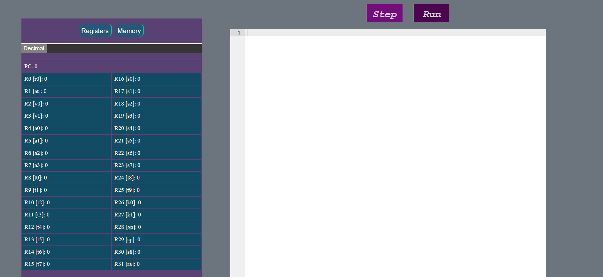
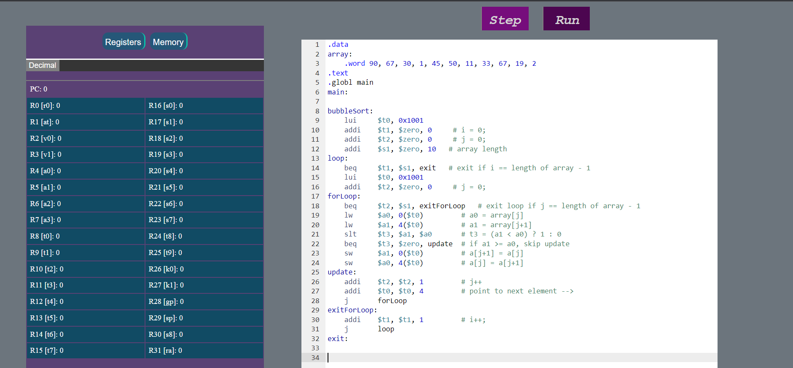
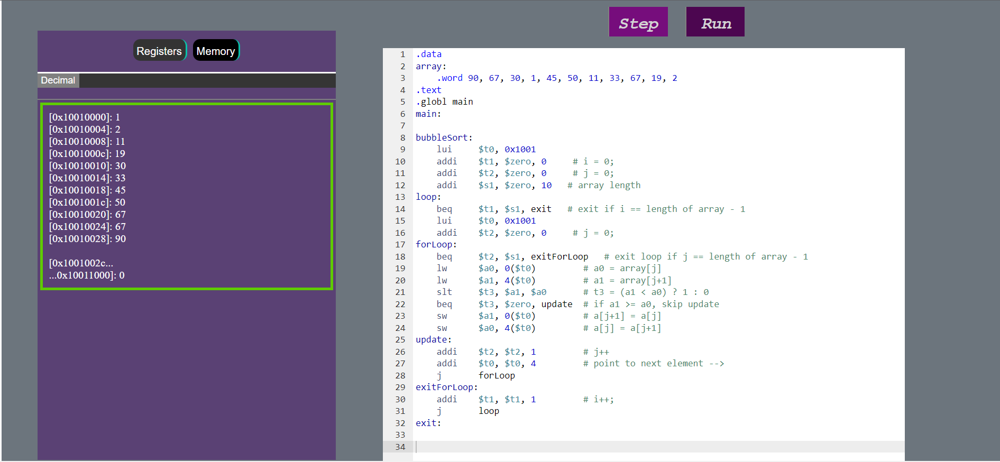

# 32-bit MIPS simulator
This project is implemented in the extent of CENG 3010 Computer Organization as the term project 1.

The simulator included the following instructions;
- add , sub, and, or, addi , andi, ori, xor,
- slt, slti, j, jr
- jal, sll, srl, sra, beq, bne
- mul, muli, lui, div
- lw, sw, lb, sb, mfhi, mflo

## Available Scripts

For run the following lines:
1. Download the zip file (or) fork this repository and use ```git clone``` to clone it on your local desktop
2. Run ```npm install```
3. Run ```npm start```

### `npm start`

Runs the app in the development mode.\
Open [http://localhost:3000](http://localhost:3000) to view it in the browser.

The page will reload if you make edits.\
You will also see any lint errors in the console.

### After Running the Project
You can try the test codes which are in the `./test` folder

## Screenshots
<p>
    Main Page
</p>
<p>
    Main Page With Code
</p>
<p>
    Memory
</p>


